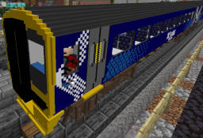

HoganFam Minecraft Train Pack
=============================

This project is to create some semi-realistic trains for use with Minecraft
Java Edition and the [TrainCarts Spigot plugin].


It consists of a resouce pack containing models and textures for various train
parts (which the Minecraft clients will need), and a saved train module to be
loaded on the server running the plugin to organise the models into trains.


Features
--------

The aim is for trains to have the following features:
 - Realistic scale.
 - Fairly high amount of detail.
 - Separate bogies wherever possible so they turn to follow curves.
 - Skinnable liveries.
 - A detailed cab.
 - A reasonable amount of seating (except where the size of Steve does not
   allow).
 - A platform on which the player can move around inside the train while
   stationary and to exit onto a platform without jumping.


Trains
------

The following trains are provided:

Train ID	| Name						| Status	| Screenshot
----------------|-----------------------------------------------|---------------|------------
[class158]	| British Rail Class 158 Express Sprinter	| Alpha		| 

[class158]: ./docs/class158.md

Detailed features for each train:

Train ID	| Front | External Skin | Cab | Seating | Bogies | External Details 
----------------|-------|---------------|-----|---------|--------|------------------
[class158]	| 80%   | 100%          | 70% | 70%     | 100%   | 50%


License 
-------

The `Makefile`, and all `.yml`, `.yml.in` files in `srv/` are released under
the [GNU General Public License, version 2].

In order to make shulkers completely invisible (these are used for platforms on
which players can walk while a train is stationary):
 - `res/assets/minecraft/textures/entity/shulker/shulker.png` is included based
   on the version in Minecraft 1.18.2, but modified to make the head made
   transparent.
 - `res/assets/minecraft/shaders/core/rendertype_entity_solid.fsh` is included
   from [MC-164001](https://bugs.mojang.com/browse/MC-164001) to fix shulker
   transparency since Minecraft 1.15.

Various other files in `res/` are from Minecraft:
 - `res/assets/minecraft/textures/items/gold_pickaxe.png`

All original files in `res/**/amalon/` are released under the [Creative Commons
Attribution-Share Alike 3.0 Unported] unless otherwise stated.
 - Copyright © 2022 James Hogan <james@albanarts.com>


Download
--------

Download links will be provided once a release is made.


Building from Source
--------------------

The included Makefile builds both a `hoganfam_trains.zip` resource pack and a
`srv/hoganfam_trains.yml` saved train module:

```shell
$ make
```


Installing
----------

### The Resource Pack

You may want to modify `hoganfam_trains.zip` or combine it with other resource
packs needed for your server.

You can put a resource pack on a webspace (it is recommended to rename it so it
has a version number to ensure clients download new versions), and set up your
Minecraft Java Edition server to point your players at it by setting the
following in your `server.properties` file:

```
resource-pack=https\://www.domain.tld/res/hoganfam_trains_v6.zip
resource-pack-sha1=86c5b594bc978fe1392e29b95d4416462f77b498
```

The SHA1 hash can be found using `sha1sums`:

```shell
$ sha1sum hoganfam_trains_v6.zip
```

### The Saved Train Module

Copy the saved train module file `srv/hoganfam_trains.yml` to
`plugins/Train_Carts/savedTrainModules` on your Minecraft Java Edition server.

Modules can be reloaded with the TrainCarts command:

```
/train globalconfig reload --savedtrainproperties
```


Spawning a train
----------------

You can then spawn a train using a [spawn
sign](https://wiki.traincarts.net/p/TrainCarts/Signs/Spawner) with a button
underneath placed under railway track, with the following text:
```
[train:left]
spawn 0.2
<trainname>
```

Where `<trainname>` is replaced with one of the provided train IDs (see Trains
above). This particular example launches the new train at 0.2 blocks/second to
the left.

[TrainCarts Spigot plugin]: https://www.spigotmc.org/resources/traincarts.39592/
[TC Coasters Spigot plugin]: https://www.spigotmc.org/resources/tc-coasters.59583/
[GNU General Public License, version 2]: https://www.gnu.org/licenses/old-licenses/gpl-2.0.html
[Creative Commons Attribution-Share Alike 3.0 Unported]: https://creativecommons.org/licenses/by-sa/3.0/
