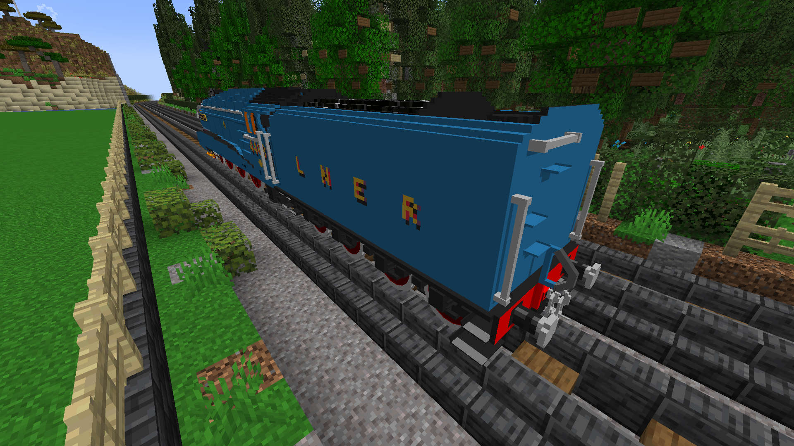

LNER Class A4
=============

 - By James Hogan

Features
--------

 - Skinned as no. 4468 (Mallard) which holds the world speed record for steam
   locomotives
 - Fully articulated (leader, loco, trailer, tender)
 - External detailing mostly done
 - Minimal cab detailing, with seats and platforms to stand on
 - Smoke from the chimney (from a hidden blaze)
 - A roaring fire in the fire box (with hidden fire balls)
 - Animated wheels
 - Partially animated wheel mechanics

Variants
--------

This train comes in the following variants:

Train ID       | Description              | Screenshot
---------------|--------------------------|------------
`a4`           | No. 4468 Mallard         | 

More Screenshots
----------------

To-do list
----------

 - [ ] External detailing
   - [ ] lamps on front & rear
 - [ ] Cab detailing
   - [ ] controls & pipes
   - [ ] more tender details
   - [ ] animated doors
 - [ ] Undercarriage detailing
   - [ ] brakes
   - [ ] fix holes
 - [ ] Finish animating moving parts
   - [x] powered wheels
   - [x] leading wheels
   - [x] trailing wheels
   - [x] coupling rods
   - [x] connecting rods
   - [ ] piston rods
   - [ ] valve gear
 - [ ] More liveries other than 4468 Mallard
