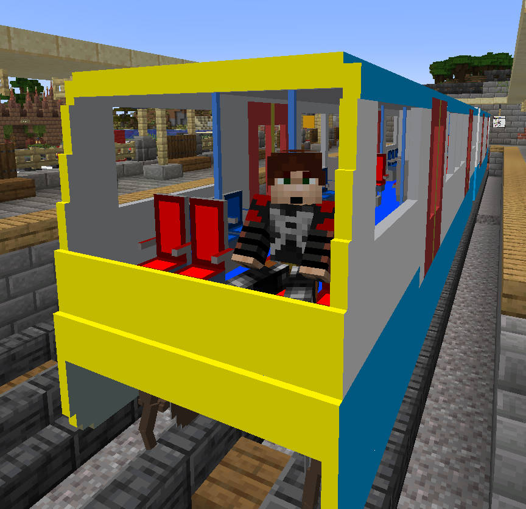

Metro (Inspired by DLR B07)
===========================



To-do list
----------

 - [x] Seat models


Stations
--------

The door open and close animations take 18 seconds (1 second to open, 16
seconds open, 1 second to close), so a station stop should be about that time.

The B07 can accelerate at 1.4 m/s<sup>2</sup> according to [Wikipedia].

Therefore the recommended [station
sign](https://wiki.traincarts.net/p/TrainCarts/Signs/Station) would look
something like this:
```
[+train]
station 1.4m/ss
18
continue
```

[Animate signs](https://wiki.traincarts.net/p/TrainCarts/Signs/Animate)
placed under the front wheels of the train when stopped at a station activate
about 2 seconds prior to the train stopping, so the recommended sign text
placed at the platform side of the rail would look something like this at the
right end of a platform:
```
[+train:left]
animate reset
doors_r
1.0 2.0
```

or this at the left end of a platform:
```
[+train:right]
animate reset
doors_l
1.0 2.0
```

[Wikipedia]: https://en.wikipedia.org/wiki/Docklands_Light_Railway_rolling_stock
